# Vartex - Multi-Asset Risk Analysis and Portfolio Management System

**Vartex** is a modular risk management system that analyzes stock risk metrics using deterministic methods and probabilistic simulations, performs PyPI security audits, and provides flexible portfolio diversification analysis.

---

## 🚀 Key Features

1. **Security & Dependency Check:** Automatically verifies `requirements.txt` against the PyPI JSON API to protect against typosquatting and hallucinated package risks.
2. **Deterministic Risk Metrics:** Calculates Volatility, Sharpe Ratio, Maximum Historical Drawdown (Max DD), and Historical VaR (95%/99%) based on logarithmic returns.
3. **Critical Risk Gates (Human-in-the-Loop):** Triggers an approval mechanism when predefined risk thresholds are exceeded.
4. **Probabilistic Projection:** Performs Monte Carlo simulations with 10,000 trials using the Geometric Brownian Motion (GBM) model.
5. **Multi-Asset Portfolio Mode (`--portfolio`):** Computes the correlation matrix among N assets, compares equally-weighted portfolio risk against individual risks, and calculates the **diversification benefit (risk savings) in USD**.
6. **Rich Terminal UI (Rich):** Renders color-coded summary panels, correlation analyses, and tables in the terminal.

---

## 📊 Output Visualizations

All charts below are real outputs produced by Vartex.

### Portfolio-Level Risk — Equal-Weighted (THYAO.IS · AAPL · GARAN.IS)

**1-Month Monte Carlo Price Projection**

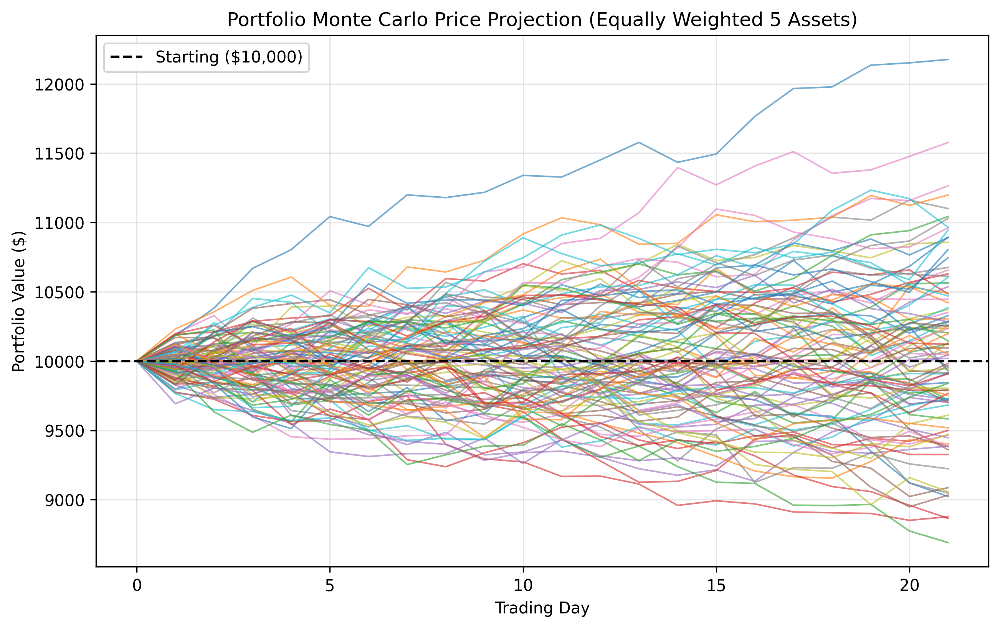

**Loss Distribution & Monte Carlo VaR Thresholds (95% / 99%)**

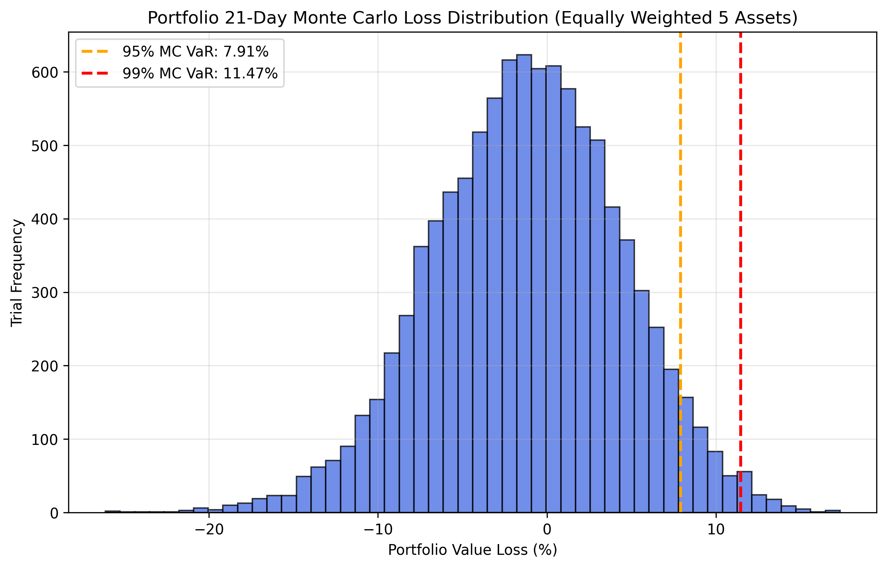

### Single-Asset Analysis

Each asset is analyzed with a 10,000-path Geometric Brownian Motion price projection (left) and a 1-day simulated return distribution with 95% / 99% VaR thresholds (right).

| Asset | Monte Carlo Price Projection | 1-Day Return Distribution (VaR) |
| :---: | :--- | :--- |
| **F** | 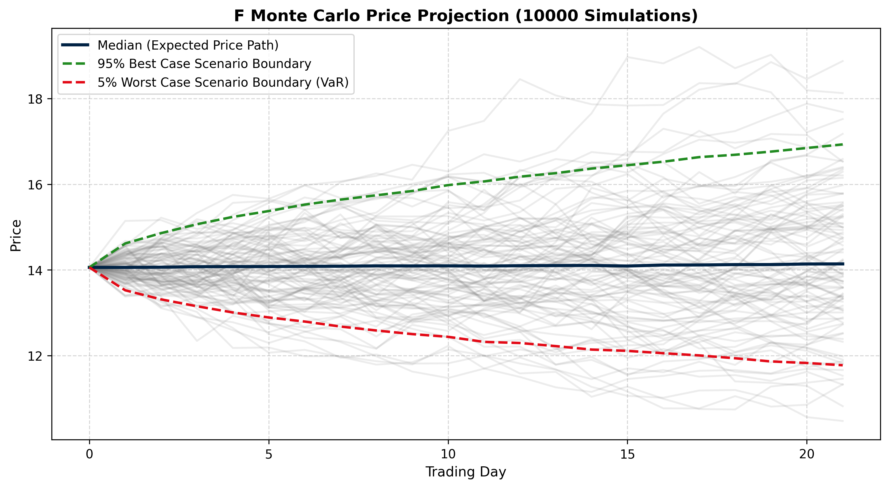 | 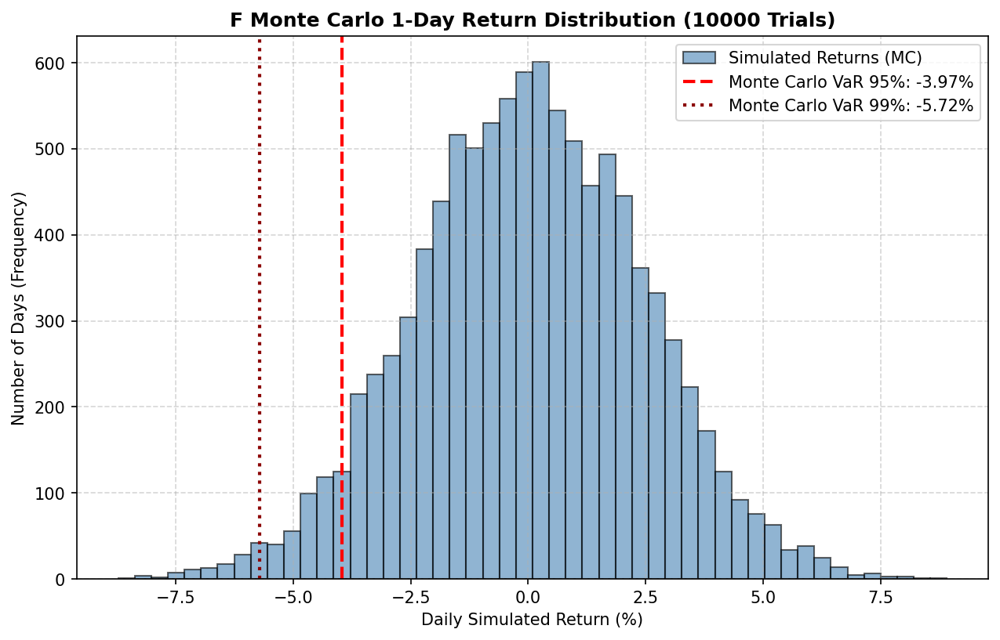 |
| **SMR** | 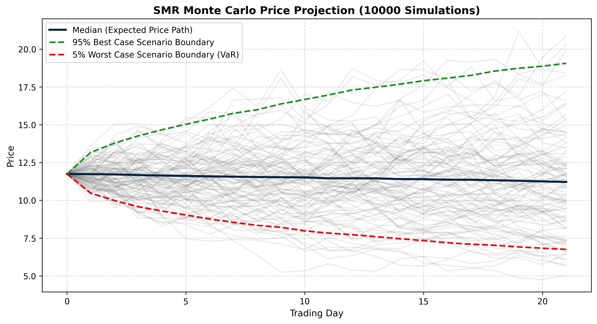 | 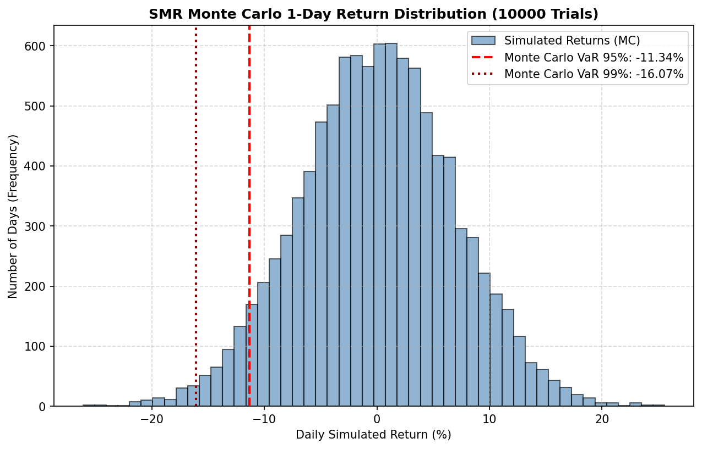 |
| **SPCX** | 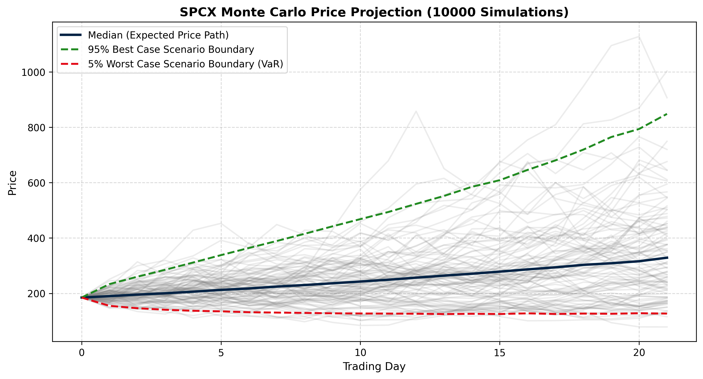 | 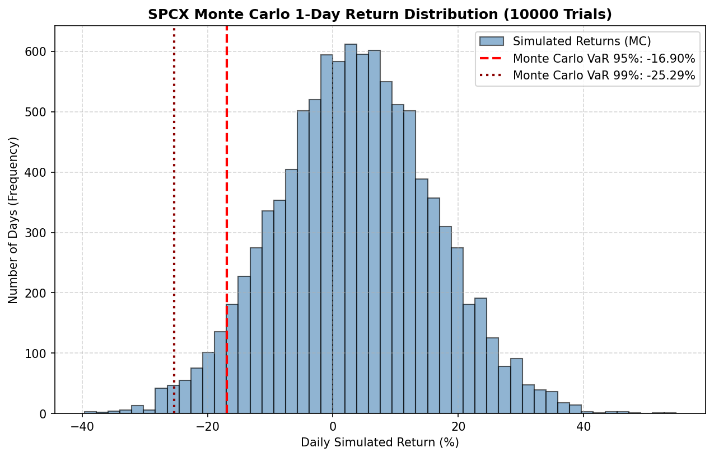 |
| **T** | 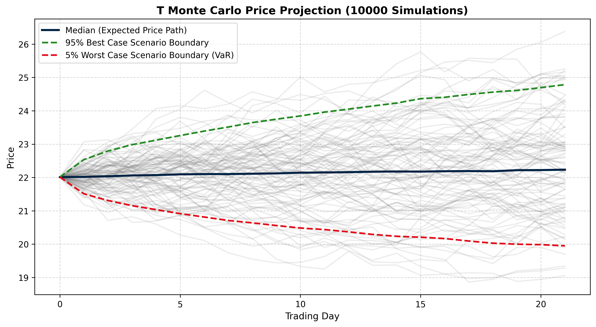 | 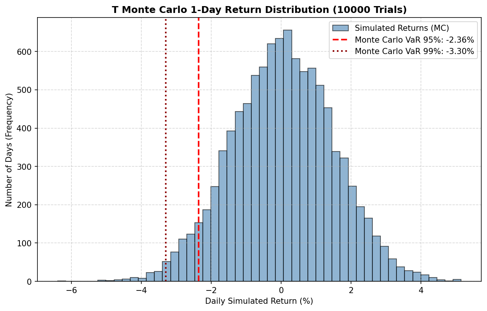 |
| **WOLF** | 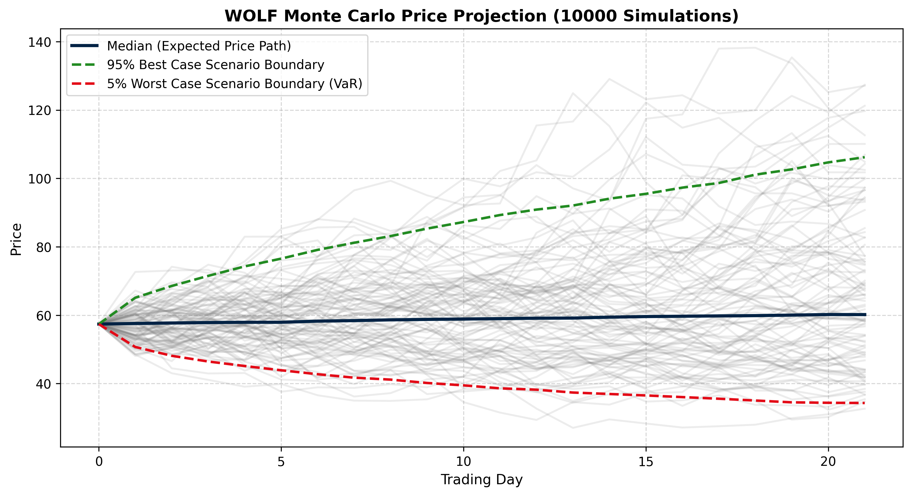 | 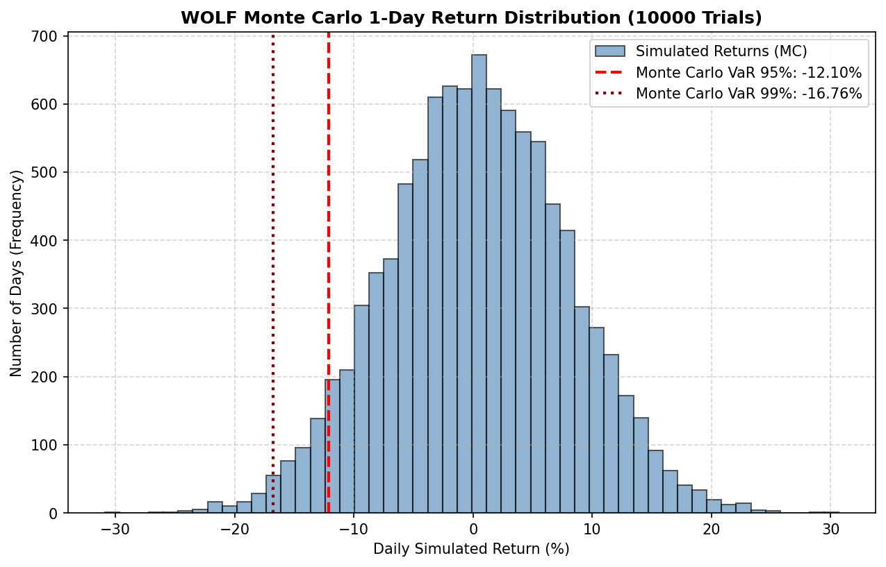 |

---

## 🛠️ Setup and Execution

### 1. Activate the Virtual Environment
* **Windows PowerShell:**
  ```powershell
  .\venv\Scripts\Activate.ps1
  ```
* **Windows CMD:**
  ```cmd
  venv\Scripts\activate.bat
  ```

### 2. Single Stock Analysis Mode
```bash
python main.py THYAO.IS
```

### 3. Multi-Asset Portfolio Risk Comparison Mode
```bash
python main.py --portfolio THYAO.IS AAPL GARAN.IS MSFT GOOGL --amount 10000 --no-interactive
```

---
*This system is written entirely using Python numpy, pandas, matplotlib, and rich libraries, and does not contain investment advice.*
