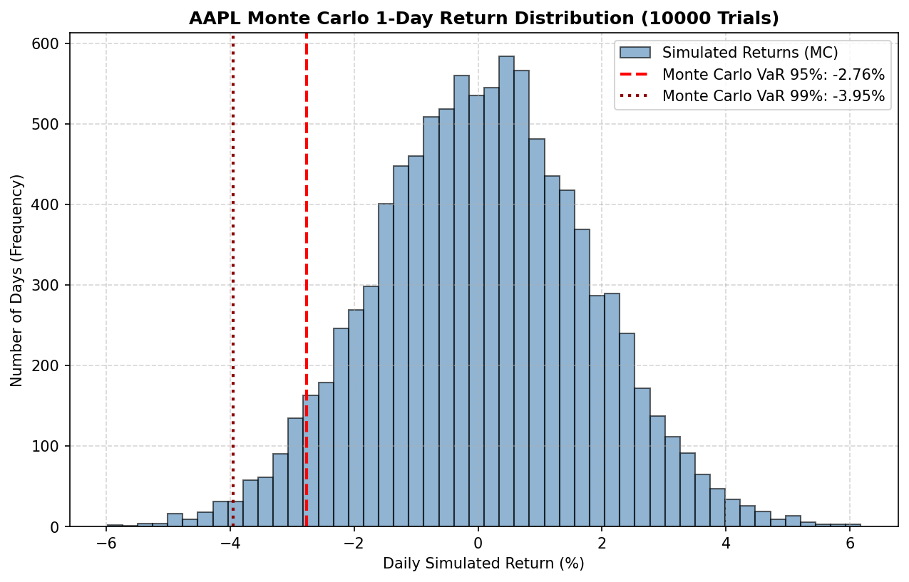

# AAPL Stock Risk Report

This report includes the risk metrics calculated using purely deterministic Python code, based on the last 2 years of daily closing prices for **AAPL** fetched via yfinance.

## Calculated Risk Metrics

| Risk Metric | Calculated Value | Description |
| :--- | :--- | :--- |
| **Annualized Volatility** | 27.72% | Annualized daily standard deviation of log returns (based on 252 trading days). Represents price variance. |
| **Historical VaR (95% Confidence)** | 2.76% | Indicates that daily loss will not exceed this rate with 95% probability based on historical data. |
| **Historical VaR (99% Confidence)** | 4.94% | Indicates that daily loss will not exceed this rate with 99% probability based on historical data (extreme risk). |
| **Sharpe Ratio (Rf = 0%)** | 0.6550 | Annualized log returns divided by annualized volatility. Performance per unit of risk. |
| **Maximum Drawdown (Max DD)** | -33.36% | The largest percentage loss recorded from peak to trough over the last 2 years. |

## Methodology and Explanations

1. **Log Returns:** Logarithmic returns ($R_t = \ln(P_t / P_{t-1})$) are used instead of simple returns due to statistical properties (symmetry, closer to normality) and additive properties over time.
2. **Historical VaR (Value at Risk):** Historical log returns are sorted from worst to best, and thresholds for the worst 5% (95% confidence) and worst 1% (99% confidence) are determined.
3. **Maximum Drawdown (Maximum Drawdown):** Measures the worst-case scenario loss if an investor buys at the peak and sells at the trough.

*Note: This report is calculated entirely using deterministic Python code. It does not contain AI predictions or probabilistic inferences.*

---

## Historical VaR vs. Monte Carlo VaR Comparison

The following table and chart compare the **Historical VaR** method using past data and the **10,000-trial Monte Carlo VaR** method over a 1-day time horizon.

### Comparison Table (AAPL)

| Confidence Level | Historical VaR | Monte Carlo VaR | Difference (MC - Historical) |
| :--- | :--- | :--- | :--- |
| **95%** | 2.76% | 2.76% | 0.00% |
| **99%** | 4.94% | 3.95% | -0.99% |

### Monte Carlo 1-Day Simulated Return Distribution (AAPL)
The distribution of returns obtained from the simulation and the Monte Carlo VaR values are shown in the chart below:

### Comparison Analysis Commentary
1. **Model Assumption:** While Monte Carlo VaR runs under the assumption that returns are normally distributed, Historical VaR directly incorporates skewness and heavy-tailed (kurtosis) properties present in historical data.
2. **Tail Deviations:** Real financial returns are typically fatter-tailed (extreme events happen more frequently) compared to a normal distribution. The differences between Historical VaR and Monte Carlo VaR in the comparison indicate the degree of these anomalies in the market.
